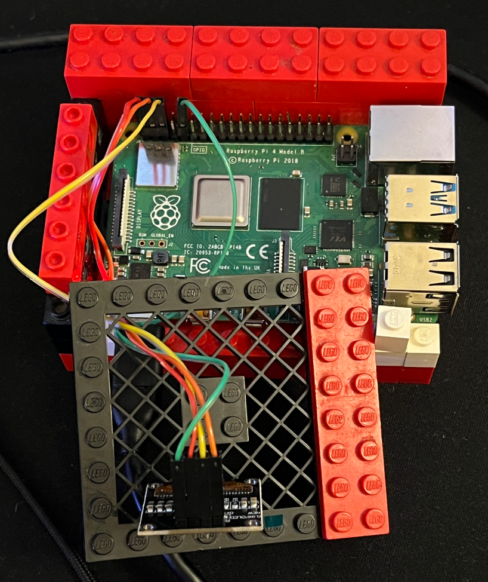

# utilmon
A simple utility monitor using a small I2C display (SSD13). Based on Adafruit's SSD1306 driver and example.


## Connections
  
- `GND` to `PIN 9`
- `VCC` to `PIN 1`
- `SCL` to `PIN 5`
- `SDA` to `PIN 3`

### Configuration
You can set the display on/off cycle duration, and change the refresh time in `utilmon.py`:
- `DISPLAY_TIME_OFF_S` defines how long the display is off each cycle
- `DISPLAY_TIME_ON_S` defines how long the display is on each cycle
- `REFRESH_TIME_S` defines how often the values are updated when the display is on

You can configure sleep hours (i.e., hours when the display remains off) in `utilmon.py` by modifying the `SLEEP_HOURS` list.

### Steps
0. ssh to RPi  
1. Enable I2C interface  
```sh
$ sudo raspi-config
```
- Select `Interface Options`
- Select `I2C`
- Select `Yes` to enable I2C interface
Reboot the device for the new setting to take effect:
```sh
$ reboot
```
- ssh back to RPi after its done booting
2. Create a new venv  
```sh
$ python3 -m venv utilmon_venv
$ source utilmon_venv/bin/activate
```
3. Install requirements (see `requirements.txt`)  
```sh
$ pip3 install -r requirements.txt
```
4. **Optional** Clone the Adafruit's SSD1306 library from GitHub  
```sh
$ git clone https://github.com/adafruit/Adafruit_CircuitPython_SSD1306.git
```
5. Run `utilmon.py` (based on stats example in Adafruit's SSD1306 library). 
```sh
# Clone the utilmon.py from this dir to your RPi, or use the stats example from
# Adafruit.
$ python3 utilmon.py
```
6. **Optional** Run as service  
Modify the path in `utilmon.service`
```sh
[Unit]
Description=SD13 based utility monitor

[Service]
ExecStart=[<Path to venv>]/bin/python3 /[<Path to utilmon>]/utilmon/utilmon.py
Restart=always

[Install]
WantedBy=multi-user.target
```
Start the service  
```sh
$ sudo cp utilmon.service /lib/systemd/system
$ sudo systemctl daemon-reload
$ sudo systemctl enable utilmon.service
$ sudo systemctl start utilmon.service
```
